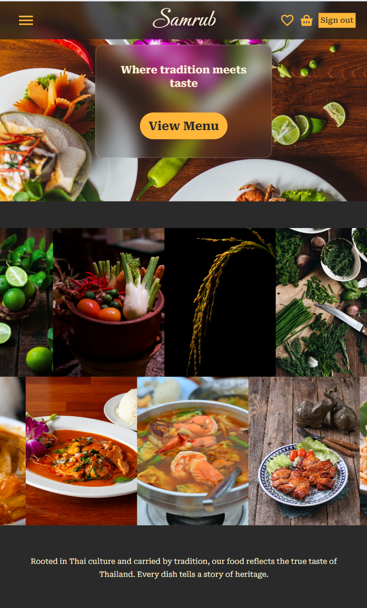
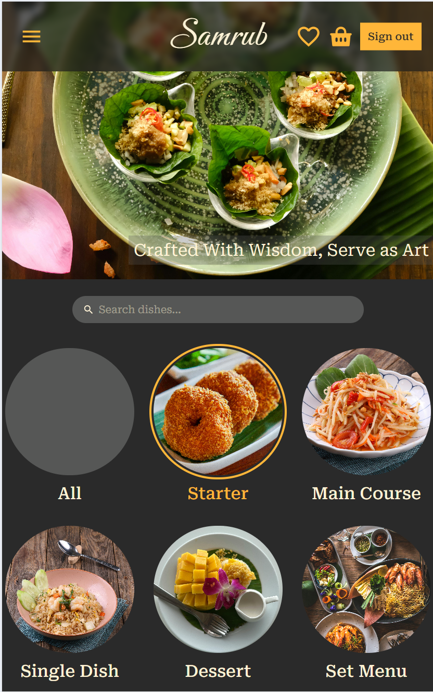
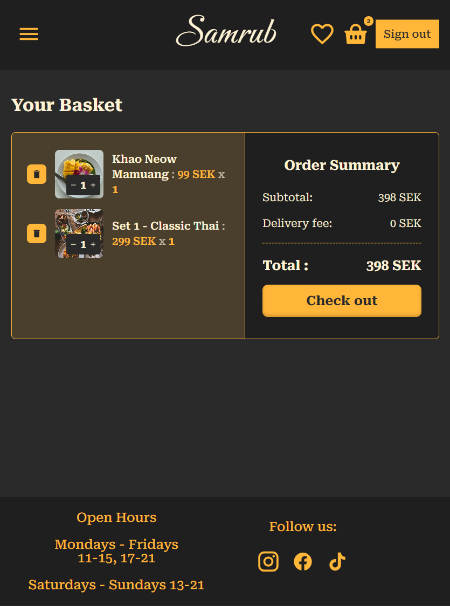
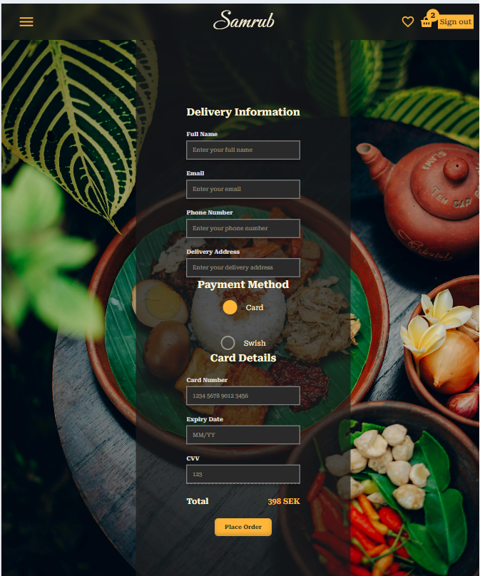
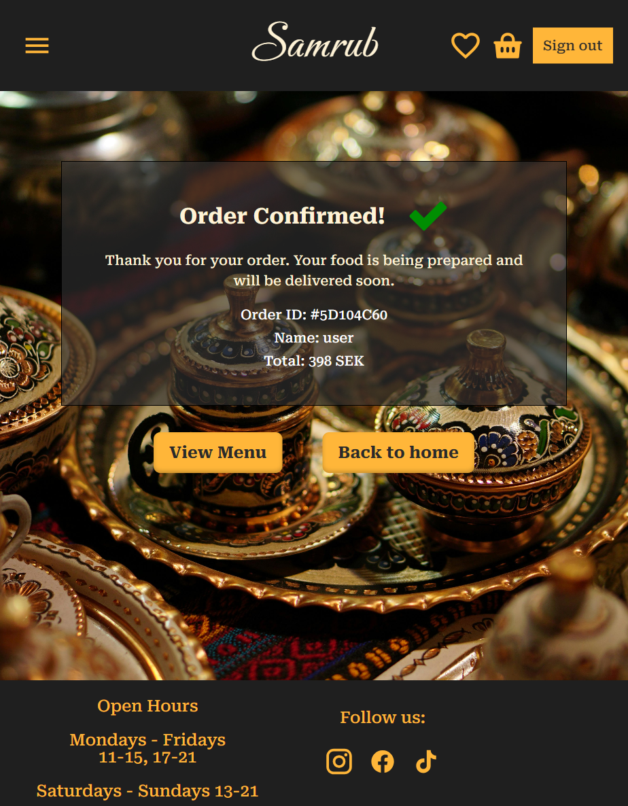
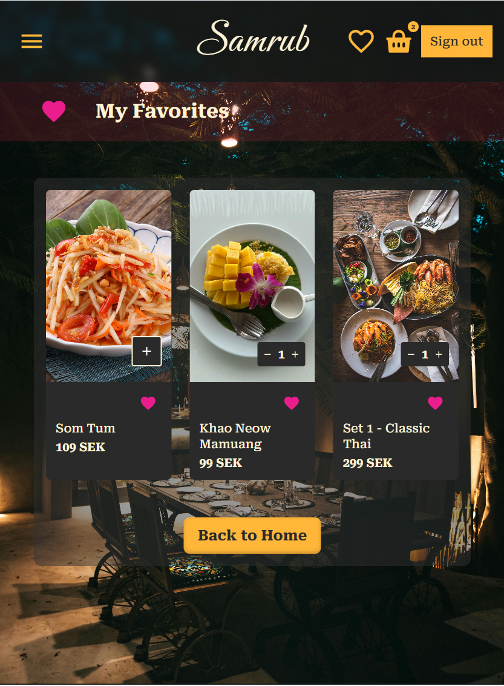
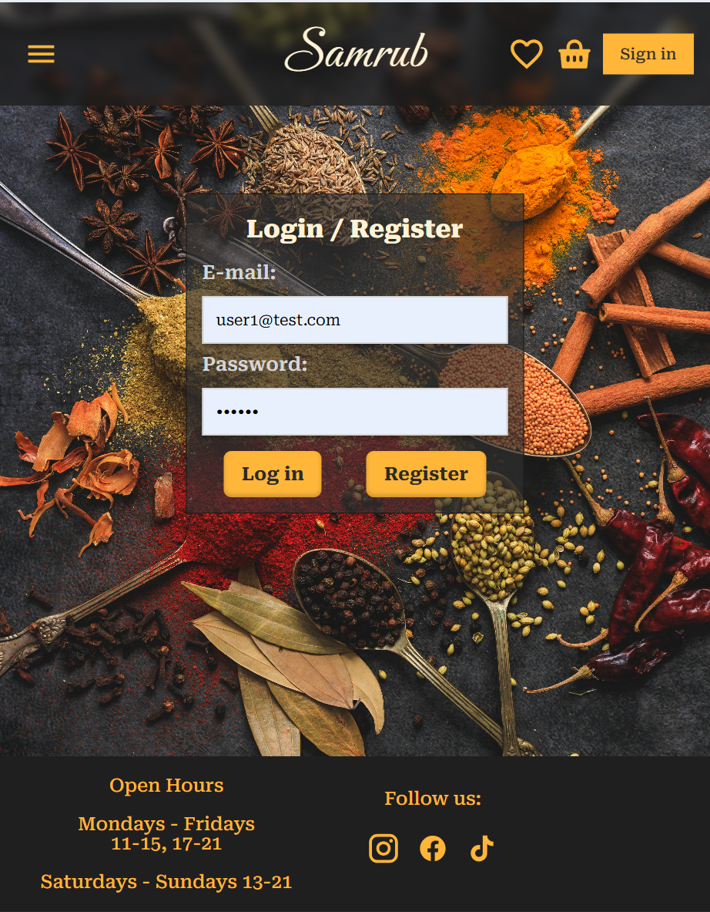
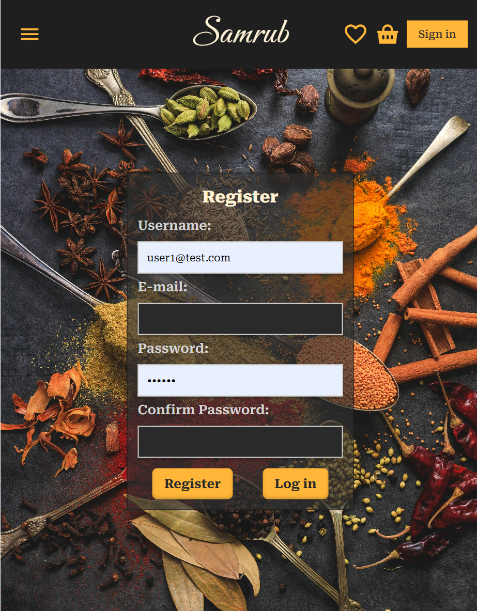

# 🍜 Samrub — Thai Food E-Commerce

> _Crafted With Wisdom, Served as Art_

**Samrub** is a full-stack online Thai food restaurant application where users can browse the menu, add dishes to their cart, and place orders — no account needed. Registered users can also save their favorite dishes.

The goal of this project was to build a complete full-stack web application from scratch, starting with a design in **Figma** — laying out the UI, planning the layout for both desktop and mobile — and then gradually bringing it to life with real code.

I chose to build a Thai food restaurant because of my personal passion for food and my love for Thai cuisine. There's nothing better than combining two things you love — food and coding. So why not start my first full-stack project with my favorite food? 🍛

_Let's enjoy eating and coding!_

Built as a solo school project for the course **Gränssnittsutveckling (SYSM9, VT26)** at Newton, Malmö.

---

## 📸 Preview

| Home                              | Menu                              |
| --------------------------------- | --------------------------------- |
|  |  |

| Basket                                | Payment                                 |
| ------------------------------------- | --------------------------------------- |
|  |  |

| Confirmation                                      | Favorites                                  |
| ------------------------------------------------- | ------------------------------------------ |
|  |  |

| Login                               | Register                                  |
| ----------------------------------- | ----------------------------------------- |
|  |  |

---

## 🧱 Tech Stack

| Layer     | Technology                    |
| --------- | ----------------------------- |
| Frontend  | React 19 + React Router v7    |
| Backend   | Node.js + Express 5           |
| Database  | MongoDB Atlas + Mongoose      |
| Auth      | JWT (jsonwebtoken) + bcryptjs |
| Styling   | Plain CSS + CSS Variables     |
| Icons     | @iconify/react                |
| HTTP      | Axios                         |
| Dev tools | Vite, Nodemon                 |

---

## 🗂️ Project Structure

```
Samrub/
├── client/                         # React frontend (Vite)
│   ├── public/
│   │   └── images/
│   │       ├── foods/              # Food product images
│   │       ├── categories/         # Category filter images
│   │       └── Ingredients/        # Home page strip images
│   └── src/
│       ├── assets/                 # hero.png
│       ├── components/
│       │   ├── Navbar/             # Top nav, hamburger, cart badge
│       │   ├── Footer/
│       │   ├── Button/             # Reusable button component
│       │   ├── FoodItem/           # Single product card (add to cart + favorite)
│       │   ├── FoodCategory/       # Category filter buttons
│       │   ├── FoodDisplay/        # Product grid with filter + search logic
│       │   └── InputField/         # Reusable input with error display
│       ├── context/
│       │   ├── StoreContext.jsx    # cart, foodList, favorites, global state
│       │   └── AuthContext.jsx     # authed, user, login, logout
│       ├── pages/
│       │   ├── Home/               # Hero + ingredient strip + food strip
│       │   ├── Menu/               # Search + category filter + food grid
│       │   ├── Basket/             # Cart items + order summary
│       │   ├── Payment/            # Delivery form + card/Swish payment
│       │   ├── Confirmation/       # Order confirmed page
│       │   ├── Favorites/          # Saved favorites (protected)
│       │   ├── Login/              # Login form
│       │   ├── Register/           # Register form
│       │   └── NotFound/           # 404 page
│       ├── services/
│       │   └── authApi.js          # Token helpers + fetch wrapper + API calls
│       ├── App.jsx                 # Routes + ProtectedRoute
│       └── main.jsx                # Entry point — BrowserRouter + Providers
│
├── server/                         # Node.js + Express backend
│   ├── src/
│   │   ├── config/
│   │   │   ├── dbConnection.js     # Mongoose connect to MongoDB Atlas
│   │   │   └── seed.js             # Seed products + default user to DB
│   │   ├── controllers/
│   │   │   ├── userController.js   # register, login, currentUser
│   │   │   ├── productController.js# getProducts, getProductById
│   │   │   ├── orderController.js  # placeOrder, getMyOrders
│   │   │   └── favoriteController.js# getFavorites, addFavorite, removeFavorite
│   │   ├── middleware/
│   │   │   ├── validationToken.js  # JWT verify middleware
│   │   │   └── errorHandler.js     # Global error handler
│   │   ├── models/
│   │   │   ├── userModel.js        # username, email, password
│   │   │   ├── productModel.js     # name, description, price, category, image, popular
│   │   │   ├── orderModel.js       # userId, items, delivery, payment, totalAmount, status
│   │   │   └── favoriteModel.js    # userId + productId (compound unique index)
│   │   └── routes/
│   │       ├── userRoutes.js
│   │       ├── productRoutes.js
│   │       ├── orderRoutes.js
│   │       └── favoriteRoutes.js
│   ├── constants.js                # HTTP status code constants
│   ├── db.json                     # Seed data (28 Thai food products)
│   ├── server.js                   # Express app entry point
│   └── .env                        # PORT, MONGO_URI, JWT_SECRET
│
└── README.md
```

---

## 🎨 Figma Design

> **[View Figma Design →](https://www.figma.com/design/JobNEImbBdPiuFXbQtgFNf/Samrub?node-id=0-1&t=EyRUuKZh0byaY8Ro-1)**

Includes:

- Desktop + Mobile wireframes
- Full UI design (Desktop + Mobile)

---

## 🔄 System Flow

```
User visits app
      │
      ▼
StoreContext loads → GET /api/products → foodList in state
      │
      ▼
Browse Menu → Filter by category / Search by name
      │
      ▼
Add to Cart → cartItems in localStorage
      │
      ▼
Basket → review items + quantities
      │
      ▼
Payment → fill delivery info + choose Card/Swish
      │          └── POST /api/orders → saved to MongoDB
      ▼
Confirmation → shows Order ID + customer name + total
```

**Auth Flow:**

```
Login → POST /api/users/login → { accessToken, user }
      │
      ├── saveToken() + saveUser() → localStorage
      ├── AuthContext: authed = true
      └── loadFavorites() → GET /api/favorites → favorites in state


Logout → clearToken() + clearUser() + clearFavorites() + clearCart()
```

**Favorites Flow:**

```
Click ❤️ (logged in)  → POST /api/favorites   → saved to MongoDB
Click ❤️ (logged out) → redirect to /login
Click ❤️ (already fav) → DELETE /api/favorites/:productId
```

---

## 🚀 Setup & Run

### Prerequisites

- Node.js installed
- MongoDB Atlas account (or use the existing `.env` connection)

### 1. Clone the repo

```bash
git clone https://github.com/MammaGula/samrub.git
cd Samrub
```

### 2. Setup Backend

```bash
cd server        # make sure you are in the Samrub/ root first
npm install
```

Create `.env` in `server/` based on template:

```
PORT=4000
MONGO_URI=your_mongodb_atlas_connection_string
JWT_SECRET=your_own_secret_key
```

Seed the database (run once):

```bash
npm run seed
```

Start the server:

```bash
npm run dev
```

✅ Server running at **http://localhost:4000**

### 3. Setup Frontend

Open a new terminal:

```bash
cd client
npm install
npm run dev
```

✅ Frontend running at **http://localhost:5173**

### API Route Testing

If you want to test the backend API routes manually, you can use the request examples in [RoutesTesting.txt](./RoutesTesting.txt).

These examples can be tested in:

- Thunder Client
- Postman
- Swagger or similar API tools

---

## 🔑 Default Login

```
Email:    user@samrub.com
Password: password
```

> No registration needed — app is fully usable as a guest (browse, cart, checkout).
> Login is required only for Favorites.

---

## 🛣️ API Routes

### Users

| Method | Route                 | Access | Description                       |
| ------ | --------------------- | ------ | --------------------------------- |
| POST   | `/api/users/register` | Public | Register new user                 |
| POST   | `/api/users/login`    | Public | Login → returns JWT + user object |

### Products

| Method | Route               | Access | Description                 |
| ------ | ------------------- | ------ | --------------------------- |
| GET    | `/api/products`     | Public | Get all products (28 items) |
| GET    | `/api/products/:id` | Public | Get product by ID           |

### Orders

| Method | Route         | Access | Description                          |
| ------ | ------------- | ------ | ------------------------------------ |
| POST   | `/api/orders` | Public | Place new order (guest or logged in) |

### Favorites

| Method | Route                       | Access       | Description           |
| ------ | --------------------------- | ------------ | --------------------- |
| GET    | `/api/favorites`            | 🔒 Protected | Get my favorites      |
| POST   | `/api/favorites`            | 🔒 Protected | Add to favorites      |
| DELETE | `/api/favorites/:productId` | 🔒 Protected | Remove from favorites |

---

## ⚠️ Common Issues & Fixes

### ❌ Port 4000 already in use

```
Error: listen EADDRINUSE :::4000
```

**Fix — find and kill the process:**

```bash
# Windows
netstat -ano | findstr :4000
taskkill /PID <PID> /F


# Mac/Linux
lsof -i :4000
kill -9 <PID>
```

### ❌ Port 5173 already in use

Vite will automatically try 5174, 5175... Check the terminal output for the actual URL.

```bash
# Or kill it manually (Mac/Linux)
lsof -i :5173
kill -9 <PID>
```

### ❌ MongoDB connection failed

- Check that `MONGO_URI` in `.env` is correct
- Make sure your IP is whitelisted in MongoDB Atlas:
  `Atlas → Network Access → Add IP Address → Allow Access from Anywhere (0.0.0.0/0)`
- Check internet connection

### ❌ Products not showing (empty menu)

Database might be empty. Re-run seed:

```bash
cd server
npm run seed
```

### ❌ Images not loading

Images must be in `client/public/images/foods/`.
Filenames are case-sensitive — must match exactly what's in `db.json`.

### ❌ JWT token expired / "Token invalid or expired"

Token lifespan is 7 days. Just log out and log back in to get a fresh token.

### ❌ App still running in another terminal?

Check all open terminals. The backend must run on port **4000** and frontend on **5173** (or next available).
If you see `✅ Server running on port 4000` and `✅ MongoDB connected` — backend is good.

---

## 🔮 Future Plans

- 🛒 **Persistent cart per user** — save cart to MongoDB so it survives logout/login
- 📦 **Order history page** — `GET /api/orders/my` already exists in the backend, just needs a frontend page
- 👤 **User profile endpoint** — `GET /api/users/current` already exists in the backend, just needs to be wired up in the frontend
- 🔍 **Backend filtering** — move category filter to server-side query (`?category=Starter`)
- 🖼️ **Image upload** — allow admin to upload food images instead of hardcoded filenames
- 👨‍🍳 **Admin panel** — manage products (add/edit/delete) from the UI
- 💳 **Real payment integration** — Stripe or Klarna instead of fake card/Swish
- 🌐 **Deployment**

---

## 📷 Image Credits

All images used in this project are free to use and were sourced from **[Pexels](https://www.pexels.com)** — a great resource for high-quality, royalty-free photography.

---

## 💬 About This Project

This project was built with two purposes in mind: fulfilling my school assignment and deepening my own understanding of full-stack development.

You'll notice that the codebase contains **a lot of comments** — and that's intentional. Writing comments is how I learn. It forces me to put concepts into my own words, helps me remember why decisions were made, and makes it easier to revisit the code later. If something is documented in detail, it means I was figuring it out as I built it.

**Feel free to explore, fork, and learn from this project.** If you're on a similar learning journey, I hope the comments and structure help you understand not just _what_ the code does, but _why_ it's written that way. Build along with me, break things, fix them — that's the process.

> ⚠️ **License note:** This project is for educational and personal learning purposes only.
> Commercial use of any kind is **not permitted**.

---

## 👨‍💻 Developer

**Supaphit** — Newton Yrkeshögskola, SYSM9, VT26

---

_🍛 Samrub — Because every meal tells a story._
